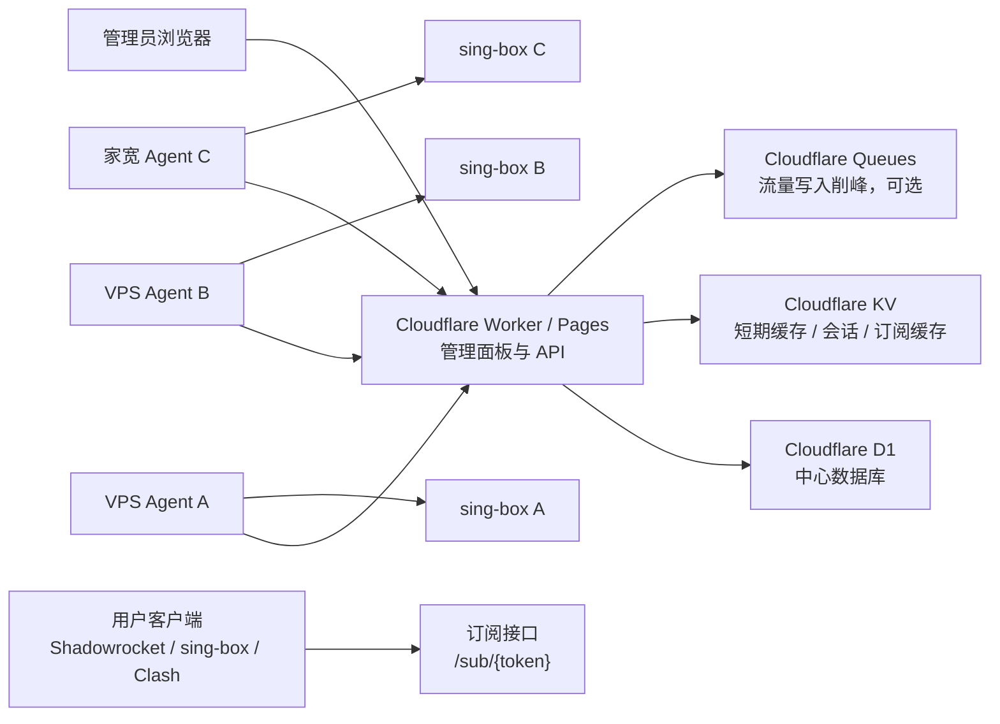
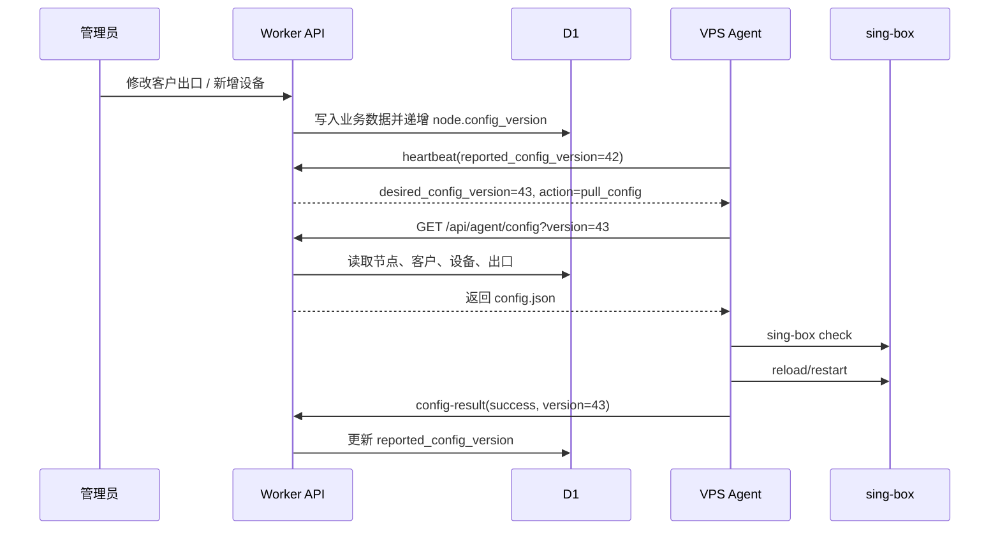
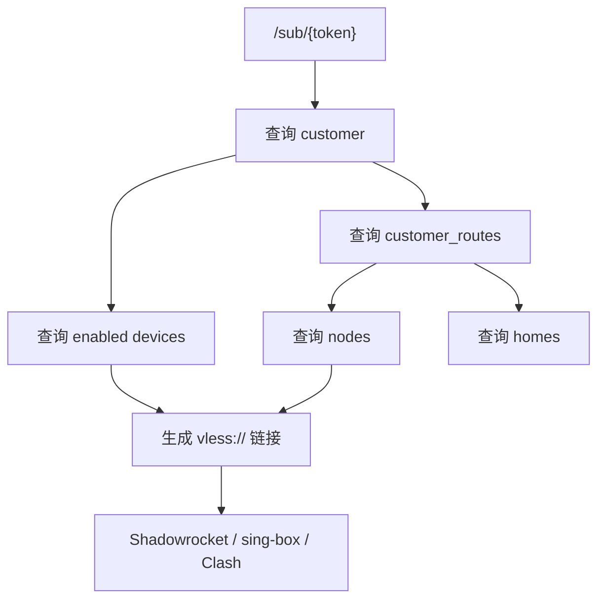

# Cloudflare 分布式面板架构方案

## 30 秒结论

当前单机版面板可以演进为 `Cloudflare Worker + D1 + VPS Agent` 的 Master/Node 架构。第一版建议采用“节点主动心跳 + 拉取指令”的模式，不要求节点开放管理端口，适合 VPS、家宽、NAT 后服务器。Durable Objects + WebSocket 可以作为第二阶段的实时控制通道，而不是第一版必选项。

## 1. 目标与边界

### 目标

- 将当前单机 `panel.py` 拆为中心控制面和节点执行面。
- 由 Cloudflare 承载 Web UI、鉴权、客户、设备、套餐、节点、路由关系和全局流量统计。
- 每台服务器只运行 sing-box 和一个轻量 Agent。
- 支持多个出口节点同时在线，并按客户分配出口。
- 支持订阅链接、链接有效期、节点名称自定义、客户流量配额和连接级流量统计。

### 不在第一版解决

- 不做在线支付、订单、自动续费。
- 不做完整审计系统和多管理员权限矩阵。
- 不做 Agent 远程 Shell。
- 不承诺毫秒级指令下发，第一版以 5 到 10 秒级生效为目标。
- 不把 Cloudflare 作为代理流量转发层，CF 只做控制面、订阅分发和 API。

## 2. 推荐架构



## 3. 组件职责

| 组件 | 部署位置 | 职责 |
| --- | --- | --- |
| Worker API | Cloudflare Workers | 登录鉴权、客户管理、设备管理、节点管理、配置版本、订阅生成 |
| Web UI | Cloudflare Pages 或 Worker static assets | 管理页面 |
| D1 | Cloudflare D1 | 主数据：客户、设备、节点、出口、配额、流量汇总 |
| KV | Cloudflare KV | 会话、订阅缓存、短期节点状态缓存 |
| Queues | Cloudflare Queues，可选 | Agent 高频流量上报削峰，异步聚合 |
| Durable Objects | Cloudflare DO，第二阶段 | 节点 WebSocket 会话、实时指令推送、节点级协调 |
| Agent | 各 VPS / 家宽机器 | 管理 sing-box、拉取配置、检查配置、重载服务、上报心跳和流量 |
| sing-box | 各 VPS / 家宽机器 | 实际代理入口、路由和出口 |

Cloudflare 官方文档依据：

- D1 是 Cloudflare 的 serverless SQL 数据库，具备 SQLite 语义，并可通过 Worker binding 查询。
- Durable Objects 支持 WebSocket Hibernation，可让 DO 空闲时休眠并保持 WebSocket 连接。
- Queues 可用于组件解耦和异步消息处理。

## 4. 通信模式选择

### 第一版推荐：主动心跳 + 指令拉取

Agent 每隔 `5-10s` 调用中心接口：

```http
POST /api/agent/heartbeat
Authorization: Bearer <node_token>
Content-Type: application/json
```

请求体：

```json
{
  "node_id": "node-us-01",
  "agent_version": "0.1.0",
  "config_version": 42,
  "singbox": {
    "running": true,
    "version": "1.x",
    "last_reload_at": 1799200000
  },
  "traffic_delta": [
    {
      "device_uuid": "82eeb079-af84-46a3-a031-74a0e7fd4be8",
      "upload_bytes": 12000,
      "download_bytes": 884000,
      "connection_id": "abc",
      "source_ip": "1.2.3.4"
    }
  ]
}
```

响应体：

```json
{
  "ok": true,
  "server_time": 1799200010,
  "desired_config_version": 43,
  "actions": [
    {
      "type": "pull_config",
      "version": 43
    }
  ]
}
```

优点：

- 节点只需要能访问 Cloudflare。
- 不需要暴露节点管理端口。
- 可兼容家宽、NAT、动态 IP。
- 实现复杂度低，适合作为迁移起点。

缺点：

- 指令延迟取决于心跳间隔。
- 高频流量统计会增加 Worker/D1 写入压力，需要批量聚合。

### 第二阶段：Durable Objects + WebSocket

Agent 主动连接：

```http
GET /api/agent/ws?node_id=node-us-01
Authorization: Bearer <node_token>
Upgrade: websocket
```

适用场景：

- 立即重启 sing-box。
- 立即踢掉客户或设备。
- 实时测速。
- 实时查看节点日志尾部。

设计约束：

- DO 应按 `node_id` 建立单节点协调对象。
- WebSocket 断开后必须回退到长轮询心跳。
- DO 只保存实时会话和短期状态，主数据仍进入 D1。

## 5. 数据模型草案

```sql
CREATE TABLE nodes (
  id TEXT PRIMARY KEY,
  name TEXT NOT NULL,
  region TEXT NOT NULL DEFAULT '',
  public_host TEXT NOT NULL,
  enabled INTEGER NOT NULL DEFAULT 1,
  token_hash TEXT NOT NULL,
  config_version INTEGER NOT NULL DEFAULT 1,
  reported_config_version INTEGER NOT NULL DEFAULT 0,
  last_seen_at INTEGER NOT NULL DEFAULT 0,
  created_at INTEGER NOT NULL
);

CREATE TABLE homes (
  id TEXT PRIMARY KEY,
  node_id TEXT NOT NULL,
  name TEXT NOT NULL,
  type TEXT NOT NULL DEFAULT 'socks5',
  server TEXT NOT NULL,
  server_port INTEGER NOT NULL,
  username TEXT NOT NULL DEFAULT '',
  password_cipher TEXT NOT NULL DEFAULT '',
  enabled INTEGER NOT NULL DEFAULT 1,
  created_at INTEGER NOT NULL,
  FOREIGN KEY (node_id) REFERENCES nodes(id)
);

CREATE TABLE customers (
  id TEXT PRIMARY KEY,
  name TEXT NOT NULL,
  enabled INTEGER NOT NULL DEFAULT 1,
  quota_bytes INTEGER NOT NULL DEFAULT 0,
  used_bytes INTEGER NOT NULL DEFAULT 0,
  default_node_id TEXT NOT NULL DEFAULT '',
  default_home_id TEXT NOT NULL DEFAULT '',
  device_limit INTEGER NOT NULL DEFAULT 0,
  limit_action TEXT NOT NULL DEFAULT 'alert',
  created_at INTEGER NOT NULL
);

CREATE TABLE devices (
  uuid TEXT PRIMARY KEY,
  customer_id TEXT NOT NULL,
  name TEXT NOT NULL,
  enabled INTEGER NOT NULL DEFAULT 1,
  node_name TEXT NOT NULL DEFAULT '',
  expires_at INTEGER NOT NULL DEFAULT 0,
  upload_bytes INTEGER NOT NULL DEFAULT 0,
  download_bytes INTEGER NOT NULL DEFAULT 0,
  created_at INTEGER NOT NULL,
  FOREIGN KEY (customer_id) REFERENCES customers(id)
);

CREATE TABLE customer_routes (
  id TEXT PRIMARY KEY,
  customer_id TEXT NOT NULL,
  node_id TEXT NOT NULL,
  home_id TEXT NOT NULL,
  priority INTEGER NOT NULL DEFAULT 100,
  enabled INTEGER NOT NULL DEFAULT 1,
  FOREIGN KEY (customer_id) REFERENCES customers(id),
  FOREIGN KEY (node_id) REFERENCES nodes(id),
  FOREIGN KEY (home_id) REFERENCES homes(id)
);

CREATE TABLE traffic_events (
  id TEXT PRIMARY KEY,
  node_id TEXT NOT NULL,
  customer_id TEXT NOT NULL,
  device_uuid TEXT NOT NULL,
  connection_id TEXT NOT NULL DEFAULT '',
  source_ip TEXT NOT NULL DEFAULT '',
  upload_bytes INTEGER NOT NULL DEFAULT 0,
  download_bytes INTEGER NOT NULL DEFAULT 0,
  reported_at INTEGER NOT NULL
);

CREATE TABLE subscriptions (
  token TEXT PRIMARY KEY,
  customer_id TEXT NOT NULL,
  enabled INTEGER NOT NULL DEFAULT 1,
  expires_at INTEGER NOT NULL DEFAULT 0,
  created_at INTEGER NOT NULL,
  FOREIGN KEY (customer_id) REFERENCES customers(id)
);
```

## 6. Worker API 草案

### 管理端接口

| 方法 | 路径 | 作用 |
| --- | --- | --- |
| `POST` | `/api/admin/login` | 管理员登录 |
| `GET` | `/api/admin/status` | 面板总览 |
| `GET` | `/api/admin/nodes` | 节点列表 |
| `POST` | `/api/admin/nodes` | 新增节点并生成 Agent token |
| `PATCH` | `/api/admin/nodes/:id` | 修改节点 |
| `GET` | `/api/admin/customers` | 客户列表 |
| `POST` | `/api/admin/customers` | 新增客户 |
| `PATCH` | `/api/admin/customers/:id` | 修改客户、配额、默认出口 |
| `POST` | `/api/admin/customers/:id/devices` | 新增设备链接 |
| `PATCH` | `/api/admin/devices/:uuid` | 修改设备名称、有效期、启停 |
| `GET` | `/api/admin/traffic` | 查询流量 |

### 节点 Agent 接口

| 方法 | 路径 | 作用 |
| --- | --- | --- |
| `POST` | `/api/agent/heartbeat` | 心跳、状态、流量增量上报 |
| `GET` | `/api/agent/config?node_id=...&version=...` | 拉取节点 sing-box 配置 |
| `POST` | `/api/agent/config-result` | 上报配置检查和重载结果 |
| `POST` | `/api/agent/logs` | 上报错误摘要，可选 |

### 用户订阅接口

| 方法 | 路径 | 作用 |
| --- | --- | --- |
| `GET` | `/sub/:token` | 返回自动识别或默认订阅格式 |
| `GET` | `/sub/:token?target=shadowrocket` | 返回 Shadowrocket 可导入链接 |
| `GET` | `/sub/:token?target=sing-box` | 返回 sing-box 客户端配置 |
| `GET` | `/sub/:token?target=clash` | 返回 Clash 配置 |

## 7. 配置版本与下发流程



关键规则：

- Worker 只生成目标配置，不直接 SSH 到节点。
- Agent 必须先 `sing-box check`，通过后才替换配置。
- Agent 本地保留最近一个可用配置，失败时自动回滚。
- D1 中每个节点维护独立 `config_version`。

## 8. Agent 改造计划

从当前 `panel.py` 提取出以下模块：

| 新模块 | 来源逻辑 | 职责 |
| --- | --- | --- |
| `agent/main.py` | `main()`、线程启动 | Agent 入口 |
| `agent/singbox.py` | `restart_singbox`、`atomic_write_config`、`clash_connections_raw` | sing-box 配置、检查、重载、连接采集 |
| `agent/traffic.py` | `poll_connection_traffic` | 连接流量 delta 计算 |
| `agent/logs.py` | `tail_singbox_logs` | source IP、客户映射采集 |
| `agent/client.py` | 新增 | 调用 Worker API、签名、重试、退避 |
| `agent/state.py` | 当前 `state.json` 的节点子集 | 本地缓存配置版本、上次连接计数 |

Agent 本地配置：

```env
NODE_ID=node-us-01
NODE_TOKEN=replace-with-generated-node-token
MASTER_URL=https://panel.example.com
SINGBOX_CONFIG_PATH=/etc/sing-box/config.json
SINGBOX_BIN=/usr/local/bin/sing-box
SINGBOX_MANAGE_MODE=systemd
CLASH_API_ADDR=127.0.0.1:9090
HEARTBEAT_SECONDS=5
```

## 9. 配额与单设备限制

### 单链接只允许一台设备

成熟面板通常不是在协议层“物理绑定设备”，而是统计同一 UUID 的并发来源 IP、连接数、User-Agent 或客户端行为后做策略限制。

第一版建议：

- 每个设备一个 UUID。
- Agent 上报 `device_uuid + source_ip + connection_id`。
- Worker 维护 `device_sessions` 的短期窗口。
- 如果一个 UUID 在 `ONLINE_WINDOW_SECONDS` 内出现超过允许数量的来源 IP，则执行 `limit_action`：
  - `alert`：只告警。
  - `disable`：禁用该设备并递增节点配置版本。
  - `throttle`：预留，后续需要 sing-box 规则配合。

### 流量统计口径

- Agent 只上报 delta，不上报累计值作为最终事实。
- Worker/D1 聚合到 `devices.upload_bytes/download_bytes` 和 `customers.used_bytes`。
- 高频明细可先进 Queue，再批量写入 D1。
- 如果 Queue 不启用，Agent 应每 5 到 10 秒批量上报，Worker 在一个事务里更新设备和客户累计值。

## 10. 订阅生成

订阅接口根据 `subscriptions.token` 找到客户，再查询该客户可使用的节点和设备：



节点名称自定义规则：

- 管理员可在设备上设置 `node_name`。
- 如果设备未设置，使用 `客户名-节点名-设备短 UUID`。
- 订阅输出中的 `#fragment` 使用 URL 编码。

## 11. 安全设计

- Agent token 只显示一次，D1 存 hash。
- Agent 请求使用 `Authorization: Bearer <token>`。
- 高安全版本可增加 HMAC：
  - Header: `X-Node-Id`
  - Header: `X-Timestamp`
  - Header: `X-Signature = HMAC_SHA256(token, method + path + body_sha256 + timestamp)`
- Worker 拒绝时间偏移过大的请求。
- 管理员 Cookie 使用 httpOnly、secure、sameSite。
- Reality 私钥不能进入 D1 明文；节点本地生成私钥，Worker 只保存公钥和短 ID，或使用加密字段保存。

## 12. 第一版开发里程碑

### M1：只读纳管

- Worker + D1 项目骨架。
- 管理员登录。
- 节点注册。
- Agent 心跳。
- 面板显示节点在线、sing-box 状态、版本、最近心跳。

验收：

- 新增节点后能复制安装命令。
- Agent 启动后 10 秒内面板显示在线。

### M2：配置下发

- D1 保存客户、设备、家宽出口。
- Worker 生成单节点 sing-box 配置。
- Agent 拉取配置、check、替换、重启。
- 失败自动回滚。

验收：

- 面板新增设备后，该节点产生可用 VLESS 链接。
- 禁用设备后，节点配置移除该 UUID。

### M3：流量与限制

- Agent 上报连接流量 delta。
- Worker 聚合客户和设备流量。
- 面板展示每个链接使用量。
- 到期禁用和配额禁用。

验收：

- 指定 VLESS 链接访问网络后，面板可看到该 UUID 的上下行增量。
- 到期设备在一个心跳周期内从节点配置移除。

### M4：订阅中心

- 生成客户订阅 token。
- 输出 Shadowrocket、sing-box、Clash 配置。
- 支持节点名称自定义。

验收：

- Shadowrocket 可直接导入订阅。
- 修改节点名称后订阅输出同步变化。

### M5：实时控制，可选

- Durable Object 为每个节点维护 WebSocket。
- 支持立即重载、立即踢设备、实时日志尾部。
- WebSocket 断线自动回退心跳。

## 13. 当前代码迁移策略

不要一次性重写。推荐在当前仓库中并行新增目录：

```text
worker/
  src/
    index.ts
    routes/
    services/
    repositories/
  migrations/
  wrangler.toml

agent/
  singbox_panel_agent/
    main.py
    client.py
    singbox.py
    traffic.py
    state.py
  pyproject.toml

legacy/
  panel.py
```

迁移原则：

- 当前 `panel.py` 保留为 legacy 单机版，直到 Worker + Agent 跑通。
- 新 Agent 复用当前 sing-box 配置生成和流量采集逻辑。
- Worker 端不要复用 Python HTML 模板，直接写 TypeScript API。
- 数据先进入 D1，后续如客户规模变大再考虑 Hyperdrive/Postgres。

## 14. 风险与处理

| 风险 | 影响 | 处理 |
| --- | --- | --- |
| D1 高频写入压力 | 流量统计丢失或成本上升 | Agent 批量上报，Worker 批量事务，必要时加 Queues |
| Agent 离线 | 节点配置无法更新 | 面板标红，保留最后一次配置，恢复后补拉 |
| Worker 不能主动连节点 | 无法直接推送 | 第一版使用节点主动拉取，第二阶段用反向 WebSocket |
| 配置下发错误 | 节点代理不可用 | Agent check 失败不替换，替换前备份，失败回滚 |
| 多节点全局配额延迟 | 超额后短时间继续可用 | 心跳周期内接受延迟，后续用 WebSocket 降低延迟 |
| Reality 私钥集中存储 | 泄露风险 | 节点本地持有私钥，中心只保存生成链接需要的公钥参数 |

## 15. 推荐决策

第一版采用：

- Worker API + D1。
- Agent 主动心跳 + 拉取配置。
- KV 做会话和订阅缓存。
- 暂不引入 Durable Objects。
- 暂不引入 Queues，除非流量上报频率导致 D1 写入压力明显。

理由：

- 与当前单机面板迁移距离最短。
- 节点无需开放管理端口。
- 家宽和动态 IP 节点可直接纳管。
- 失败模式可控，中心不可用时节点仍保留最后一次 sing-box 配置。

## 16. 参考链接

- Cloudflare D1: https://developers.cloudflare.com/d1/
- D1 Worker Binding API: https://developers.cloudflare.com/d1/worker-api/
- Durable Objects WebSocket Hibernation: https://developers.cloudflare.com/durable-objects/best-practices/websockets/
- Durable Objects 概念: https://developers.cloudflare.com/durable-objects/concepts/what-are-durable-objects/
- Cloudflare Queues: https://developers.cloudflare.com/queues/
